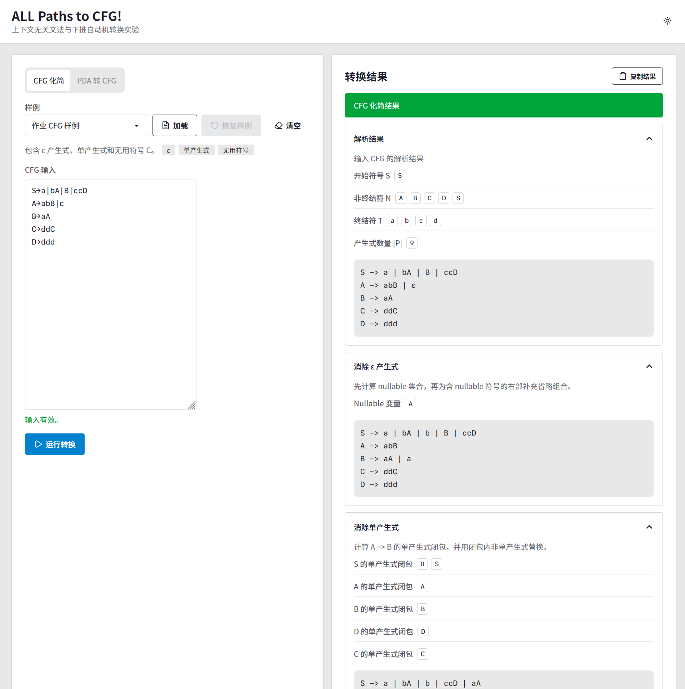

# ap2cfg

这是我们在“理论计算机科学基础”课程中完成的小组项目。课程作业要求实现 CFG 化简，以及把空栈接受的 PDA 转换为等价 CFG。我们把两个算法做成了一个静态网页，输入讲义中的文法或自动机后，页面会按步骤展示转换过程和最终结果。



## 我们做了什么

项目包含两条处理流程：

1. 解析 CFG，依次消除 `ε` 产生式、单产生式和无用符号。
2. 解析空栈接受的 PDA，使用 `<p,A,q>` 变量构造 CFG，再复用前一条流程完成化简。

页面会保留 nullable 集合、单产生式闭包、可生成符号和可达符号等中间结果。这样既能检查算法是否按预期执行，也便于对照教材理解每一步发生了什么。

输入解析兼容课程讲义中常见的全角括号、全角逗号、`→` 和 `ε`。页面内置了作业样例和几组补充样例，可以直接加载运行。

## 运行项目

项目需要 Node.js 和 npm。克隆仓库后运行：

```bash
npm install
npm run dev
```

Vite 会在终端中给出本地访问地址。

如果只想生成静态页面，可以运行：

```bash
npm run build
```

构建结果位于 `dist/`。课程提交时还需要一个可以直接打开的文件，因此我们另外提供了：

```bash
npm run build:file
```

这个命令会把 JavaScript 和 CSS 写入 `dist/index.html`，不启动服务器也可以在浏览器中打开。

## 输入示例

CFG 可以沿用教材中的写法：

```text
S→a|bA|B|ccD
A→abB|ε
B→aA
C→ddC
D→ddd
```

也可以使用 ASCII 箭头并加入空格：

```text
S -> a | bA | B | ccD
```

PDA 输入由一个定义和若干条转移组成：

```text
M=({q0,q1},{a,b},{B,z0},δ,q0,z0,Φ)
δ(q0,b,z0)={(q0,Bz0)}
δ(q0,a,B)={(q1,ε)}
```

完整格式、符号切分规则和作业样例见[实验报告](./实验报告.md)。

## 实现上的选择

核心算法和输入解析都使用 TypeScript 编写。Preact、Tailwind CSS 和 daisyUI 只负责页面显示。代码按下面的职责拆分：

| 文件 | 内容 |
| --- | --- |
| `src/parser.ts` | 输入归一化、CFG 与 PDA 解析、格式检查 |
| `src/core.ts` | CFG 化简和 PDA 转 CFG |
| `src/format.ts` | 文法输出和符号格式化 |
| `src/samples.ts` | 页面与测试共用的样例 |
| `src/main.tsx` | 页面交互和步骤展示 |
| `tests/core.test.ts` | 核心算法与输入样例测试 |

我们把 parser、算法和 UI 分开，是因为调试算法时需要直接比较内部结果，不能只看页面有没有正常显示。页面和测试读取同一份样例，修改样例后可以同时检查展示和转换结果。

PDA 转 CFG 可能生成很多中间产生式。课程演示更关心转换过程，因此我们保留了逐步结果，没有继续做适合大输入的分页和性能优化。

## 验证

可以一次运行类型检查、自动化测试和构建：

```bash
npm run check
npm run test
npm run build
```

现有测试覆盖课程给出的 CFG 和 PDA、相邻大写非终结符、nullable 变量组合、单产生式链、无用符号，以及超出支持范围的 PDA 转移。测试会检查转换流程能完成，并检查结果中不再出现相应的待消除结构。

这些测试用于验证课程样例和几类边界输入。项目没有实现 CFG 与 PDA 的通用等价性判定，因此不能把测试通过理解为对任意输入都给出了形式化证明。

## 当前范围

这个项目按课程要求确定了输入范围：

- PDA 使用空栈接受。
- 每条转移右侧只接受一个目标二元组，多分支需要拆成多行。
- 每条转移最多压入两个栈符号。
- CFG 的普通非终结符使用单个大写字母或带数字后缀的形式，PDA 转换产生的变量使用 `<p,A,q>`。
- 大型 PDA 会产生较多变量和产生式，当前页面没有针对这类输入做渲染优化。

后续同学如果准备扩展它，可以先补 PDA 转移预处理和更系统的语义测试，再扩大输入格式。原始作业要求保存在 [`assessmemt.txt`](./assessmemt.txt)，完整的算法说明、输入规则和测试截图在[实验报告](./实验报告.md)中。
