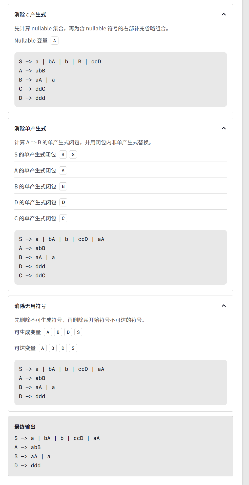
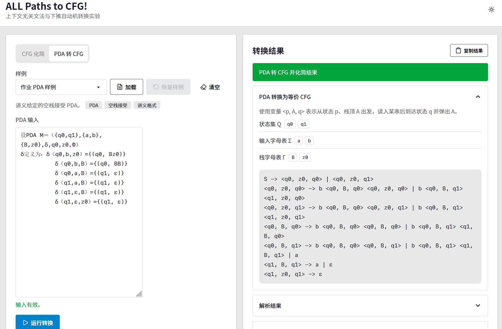
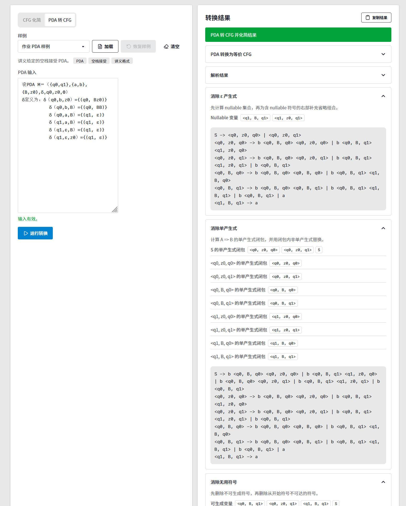
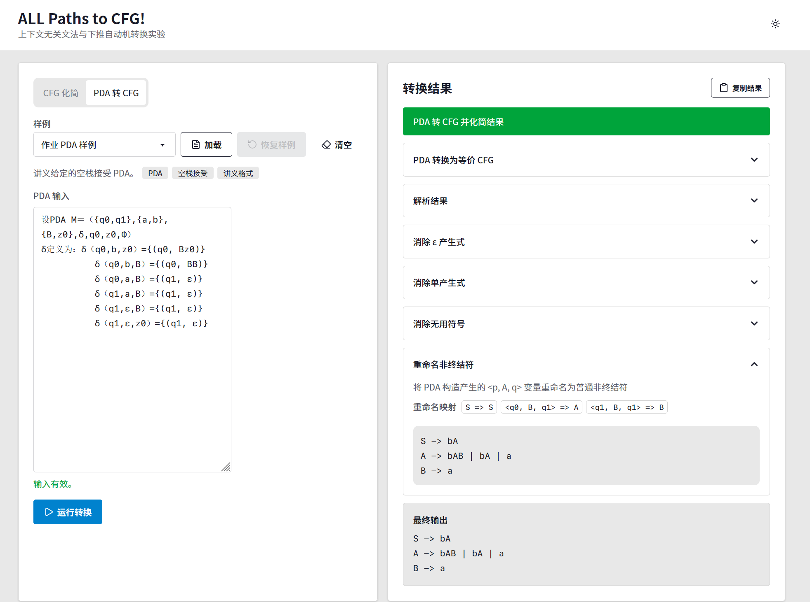
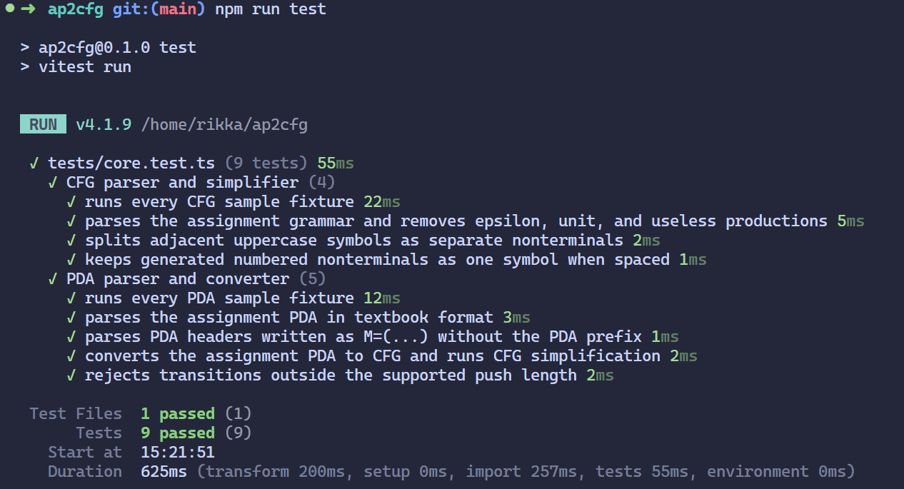

# 理论计算机科学基础实验报告

## 1. 实验基本信息

这是“理论计算机科学基础”课程中关于上下文无关文法与下推自动机的小组实验。公开版本删去了成员姓名、学号和班级信息，保留项目分工如下。

| 分工 | 主要内容 |
| --- | --- |
| 核心实现 | 项目选型、整体架构、CFG 和 PDA 内部数据结构、CFG 化简、PDA 转 CFG、样例与测试设计 |
| 输入解析 | CFG 和 PDA 格式解析、全角符号与箭头归一化、输入校验和错误提示 |
| 页面实现 | 页面布局、样例加载、实时校验、结果与中间步骤展示、主题适配 |
| 测试与文档 | 作业要求核对、测试执行、截图、实验报告和提交材料整理 |


## 2. 实验目的

本实验围绕上下文无关文法和下推自动机之间的转换关系展开，主要完成两个任务。

第一，设计并实现上下文无关文法的变换算法。程序需要在不改变原文法语言生成能力的前提下，消除文法中的 `ε` 产生式、单产生式以及无用符号，输出一个更适合后续分析的等价上下文无关文法。

第二，设计并实现由下推自动机构造等价上下文无关文法的算法。程序需要读入一个空栈接受的 PDA，构造与其等价的 CFG，并继续调用 CFG 化简算法，输出没有 `ε` 产生式、单产生式和无用符号的最终文法。

## 3. 实验环境

本项目为了方便演示和运行，实现为一个静态 Web 工具（**双击 index.html 文件运行**），核心算法和页面逻辑均使用 TypeScript 编写，下面这些库仅用于前端界面渲染。

| 项目 | 内容 |
| --- | --- |
| 编程语言 | TypeScript |
| 构建工具 | Vite |
| 前端框架 | Preact + TSX |
| 样式方案 | Tailwind CSS + daisyUI |
| 图标库 | lucide-preact |
| 测试工具 | Vitest |
| 运行环境 | Node.js、现代浏览器 |

项目可以通过如下命令运行和验证：

```bash
npm install
npm run dev
npm run check
npm run test
npm run build
```

其中 `npm run dev` 用于启动开发服务器，`npm run build` 用于生成静态网页程序，构建结果位于 `dist/` 目录，可作为可执行程序提交。

## 4. 程序总体设计

程序采用在线转换器形式，左侧为输入区，右侧为转换结果和中间步骤展示区。用户可以直接输入 CFG 或 PDA，也可以通过页面内置样例快速加载测试数据。

程序整体流程如下：

```text
字符串输入
  -> 字符归一化
  -> Parser / Validator
  -> Grammar / PDA 内部对象
  -> 核心转换算法
  -> TraceStep 中间过程记录
  -> Formatter 规范化输出
  -> Web UI 展示
```

项目设计中将 UI、输入解析、核心算法、过程记录和格式化输出分离，避免把页面交互和理论算法混在一起。

主要源码文件职责如下：

| 文件 | 作用 |
| --- | --- |
| `src/parser.ts` | 解析 CFG 文本和 PDA 文本，并进行基本格式校验 |
| `src/core.ts` | 核心，实现 CFG 化简算法和 PDA 到 CFG 的转换算法 |
| `src/format.ts` | 将内部对象格式化为标准文本输出 |
| `src/samples.ts` | 维护页面和测试共用的样例输入 |
| `src/main.tsx` | 实现 Web 页面和交互逻辑 |
| `tests/core.test.ts` | 自动化测试核心算法和样例输入 |

## 5. 输入与输出格式

### 5.1 通用输入归一化

为了普通键盘输入，程序在解析前会先对文本做归一化处理。归一化只改变输入形式，不改变文法或 PDA 的语义。

| 输入形式 | 归一化后 |
| --- | --- |
| 换行 | `\n` |
| 全角括号 `（`、`）` | 半角括号 `(`、`)` |
| 全角花括号 `｛`、`｝` | 半角花括号 `{`、`}` |
| 全角逗号 `，` | 半角逗号 `,` |
| 全角冒号 `：` | 半角冒号 `:` |
| 全角等号 `＝` | 半角等号 `=` |
| `→`、`=>`、`->` | 统一为 `->` |
| `lambda`、`Λ`、`ϵ`、`ε` | 统一为空串符号 `ε` |
| `∅` | 统一为空栈接受标记 `Φ` |

因此，教材中的中文全角符号和普通 ASCII 符号可以混合输入。

### 5.2 CFG 输入格式

CFG 输入按行书写产生式。每个非空行必须包含且只包含一个产生式箭头，箭头左侧是一个非终结符，箭头右侧是一个或多个候选式，候选式之间用 `|` 分隔。

```text
S→a|bA|B|ccD
A→abB|ε
B→aA
C→ddC
D→ddd
```

同一输入也可以写成 ASCII 形式：

```text
S -> a | bA | B | ccD
A -> abB | ε
B -> aA
C -> ddC
D -> ddd
```

CFG 左部非终结符支持两种形式：

| 形式 | 示例 | 说明 |
| --- | --- | --- |
| 单个大写字母，可带数字后缀 | `S`、`A`、`A1` | 普通 CFG 非终结符 |
| 尖括号变量 | `<q0,B,q1>`、`<q0, B, q1>` | PDA 转 CFG 中间变量 |

CFG 右部符号按以下规则切分：

| 输入 | 解析结果 | 说明 |
| --- | --- | --- |
| `ε` 或空候选式 | 空串 | 表示 `ε` 产生式 |
| `bA` | `b`、`A` | 小写字母作为终结符，大写字母作为非终结符 |
| `AB` | `A`、`B` | 连续大写字母按多个非终结符切分 |
| `A1` | `A1` | 大写字母后紧跟数字时作为一个非终结符 |
| `<q0,B,q1>` | `<q0,B,q1>` | 尖括号内整体作为一个非终结符 |
| `'id'` 或 `"id"` | `id` | 引号中的内容作为一个终结符 |
| 其他单字符 | 原字符 | 作为终结符处理 |

右部可以加入空格，空格只用于提高可读性，不作为符号。例如 `a A1` 和 `aA1` 在当前解析规则下都会被解析为终结符 `a` 后接非终结符 `A1`。

程序还会进行基本合法性检查：

- 每个产生式行必须有唯一箭头。
- 左部必须是合法非终结符。
- 开始符号取第一条产生式的左部。
- 右部使用到的非终结符必须至少在某条产生式左部声明。
- 重复产生式会自动去重。

### 5.3 PDA 输入格式

PDA 输入支持讲义中的定义方式。程序可以识别 `设PDA M=...`，也可以识别省略 `PDA` 前缀的 `M=...`。由于输入会先归一化，下面两种写法都可以被识别。

```text
设PDA M＝（{q0,q1},{a,b},{B,z0},δ,q0,z0,Φ）
```

```text
M=({q0,q1},{a,b},{B,z0},δ,q0,z0,Φ)
```

PDA 定义头部的格式为：

```text
M=({状态集},{输入字母表},{栈字母表},δ,初始状态,栈底符号,Φ)
```

其中：

- 状态集、输入字母表、栈字母表使用 `{...}` 包围。
- 集合内部元素用逗号分隔。
- 初始状态必须出现在状态集中。
- 栈底符号必须出现在栈字母表中。
- 最后一项支持 `Φ` 或 `empty`，表示空栈接受。

转移函数格式为：

```text
δ(当前状态, 输入符号, 待弹出栈符号)={(目标状态, 压栈串)}
```

例如：

```text
δ（q0,b,z0）={(q0, Bz0)}
δ（q0,a,B）={(q1, ε)}
δ（q1,ε,z0）={(q1, ε)}
```

转移函数支持以下情况：

| 情况 | 示例 | 说明 |
| --- | --- | --- |
| 普通读入 | `δ(q0,b,z0)={(q0,Bz0)}` | 读入输入符号 `b` |
| 空输入 | `δ(q1,ε,z0)={(q1,ε)}` | 不消耗输入符号 |
| 只弹栈 | `δ(q1,a,B)={(q1,ε)}` | 弹出 `B`，不压入新符号 |
| 压入 1 个栈符号 | `δ(q0,b,B)={(q0,B)}` | 弹出后压入一个符号 |
| 压入 2 个栈符号 | `δ(q0,b,B)={(q0,BB)}` | 弹出后压入两个符号 |

压栈串会根据栈字母表切分。例如栈字母表为 `{B,z0}` 时，`Bz0` 会被切分为 `B`、`z0`。程序会优先匹配较长的栈符号，因此可以正确识别 `z0` 这类多字符栈符号。

PDA 输入也会进行合法性检查：

- 至少需要识别到一个 PDA 定义头部。
- 至少需要识别到一条转移函数。
- 转移中出现的当前状态和目标状态必须在状态集中声明。
- 非空输入符号必须在输入字母表中声明。
- 待弹出栈符号必须在栈字母表中声明。
- 压栈串必须能够按栈字母表切分。
- 每条转移的压栈长度不能超过 2；超过 2 时会提示超出本实验工具范围。

当前程序面向本实验要求实现，每条转移函数右侧支持一个目标二元组，即 `δ(...)={(q, γ)}`。若要表达多个目标分支，应拆成多行分别输入。

完整 PDA 输入示例：

```text
设PDA M＝（{q0,q1},{a,b},{B,z0},δ,q0,z0,Φ）
δ定义为：δ（q0,b,z0）={(q0, Bz0)}
          δ（q0,b,B）={(q0, BB)}
          δ（q0,a,B）={(q1, ε)}
          δ（q1,a,B）={(q1, ε)}
          δ（q1,ε,B）={(q1, ε)}
          δ（q1,ε,z0）={(q1, ε)}
```

### 5.4 输出格式

CFG 化简和 PDA 转 CFG 的最终结果都输出为标准 CFG 文本。输出格式为：

```text
左部 -> 候选式1 | 候选式2 | 候选式3
```

CFG 输出示例：

```text
S -> a | bA | b | ccD | aA
A -> abB
B -> aA | a
D -> ddd
```

PDA 转 CFG 的中间输出使用变量 `<p, A, q>`，含义是：从状态 `p` 出发，栈顶为 `A`，读入某个串后到达状态 `q` 并弹出 `A`。最终输出会将这些中间变量重命名为普通非终结符，避免最终文法中保留尖括号变量。

## 6. 核心算法设计

### 6.1 消除 `ε` 产生式

程序首先计算 nullable 集合，即所有能够推出空串的非终结符。

算法过程如下：

```text
nullable = empty set
repeat
  for each production A -> α
    if α is ε, or every symbol in α is nullable
      add A to nullable
until nullable no longer changes
```

得到 nullable 集合后，程序遍历每条产生式。若产生式右部包含 nullable 非终结符，则枚举这些符号保留或省略的组合，生成新的产生式。对于非开始符号，程序不会保留右部为空的产生式；若开始符号本身可空，则保留开始符号推出 `ε` 的情况。

### 6.2 消除单产生式

单产生式指形如 `A -> B` 的产生式，其中 `A` 和 `B` 都是非终结符。

程序为每个非终结符计算单产生式闭包。闭包含义是：如果存在一系列单产生式使得 `A => B`，则 `B` 属于 `A` 的单产生式闭包。

算法过程如下：

```text
unitClosure[A] = { A }
repeat
  for each unit production A -> B
    unitClosure[A] = unitClosure[A] union unitClosure[B]
until all closures no longer change
```

得到闭包后，对于每个 `A`，程序取出其闭包中所有非终结符的非单产生式，并将这些产生式复制为 `A` 的产生式。原有单产生式不再保留。

### 6.3 消除无用符号

无用符号分为两类：不可生成符号和不可达符号。

第一步，计算可生成非终结符。若某个产生式右部只包含终结符，或只包含终结符和已经可生成的非终结符，则该产生式左部也是可生成的。

```text
generating = empty set
repeat
  for each production A -> α
    if every nonterminal in α is generating
      add A to generating
until generating no longer changes
```

第二步，在删除不可生成产生式后，从开始符号出发计算可达非终结符。只有同时可生成且可达的符号和产生式会被保留。

### 6.4 PDA 到 CFG 的转换

程序使用变量 `<p, A, q>` 表示 PDA 从状态 `p` 出发，栈顶为 `A`，读入某个串后到达状态 `q` 并弹出 `A` 所能识别的语言。

设 PDA 的开始状态为 `q0`，栈底符号为 `z0`。CFG 的开始符号为 `S`，程序首先为每个状态 `q` 加入：

```text
S -> <q0, z0, q>
```

之后根据 PDA 转移函数构造产生式。

若转移弹出栈顶但不压栈：

```text
δ(p, a, A) contains (r, ε)
```

则加入：

```text
<p, A, r> -> a
```

若输入符号 `a` 为 `ε`，则右部为空。

若转移压入一个栈符号：

```text
δ(p, a, A) contains (r, B)
```

则对每个状态 `q` 加入：

```text
<p, A, q> -> a <r, B, q>
```

若转移压入两个栈符号：

```text
δ(p, a, A) contains (r, B C)
```

则对每个中间状态 `s` 和结束状态 `q` 加入：

```text
<p, A, q> -> a <r, B, s> <s, C, q>
```

构造出的 CFG 可能包含 `ε` 产生式、单产生式和无用符号，因此程序会继续调用 CFG 化简算法。最后，程序将 PDA 构造产生的 `<p, A, q>` 变量重命名为 `A`、`B`、`C` 等普通非终结符，使最终输出更符合常规 CFG 形式。

## 7. 页面功能设计

页面主要分为输入区和输出区。

输入区提供：

- CFG 化简和 PDA 转 CFG 两种模式切换。
- 多个内置样例的一键加载。
- 纯文本输入框。
- 实时格式校验；输入无法解析时，运行按钮不可用。

输出区提供：

- 转换结果提示。
- 每个算法阶段的中间步骤。
- 集合信息，例如 nullable 集合、单产生式闭包、可生成变量和可达变量。
- 中间文法和最终文法。
- 复制最终结果按钮。

该设计便于展示输入、算法过程和输出结果。

## 8. 测试用例与执行效果

### 8.1 作业 CFG 样例

输入：

```text
S→a|bA|B|ccD
A→abB|ε
B→aA
C→ddC
D→ddd
```

测试目的：

- 验证 `ε` 产生式消除。
- 验证单产生式 `S -> B` 的消除。
- 验证无用符号 `C` 的删除。

程序输出的最终文法示例：

```text
S -> a | bA | b | ccD | aA
A -> abB
B -> aA | a
D -> ddd
```

执行效果如下图所示：

<p align="center">
  <br>
  图 1 CFG 样例输入与解析结果
</p>

<p align="center">
  <br>
  图 2 CFG 化简最终输出
</p>

### 8.2 作业 PDA 样例

输入：

```text
设PDA M＝（{q0,q1},{a,b},{B,z0},δ,q0,z0,Φ）
δ定义为：δ（q0,b,z0）={(q0, Bz0)}
          δ（q0,b,B）={(q0, BB)}
          δ（q0,a,B）={(q1, ε)}
          δ（q1,a,B）={(q1, ε)}
          δ（q1,ε,B）={(q1, ε)}
          δ（q1,ε,z0）={(q1, ε)}
```

测试目的：

- 验证教材格式 PDA 的解析。
- 验证 PDA 到 CFG 的中间构造。
- 验证构造出的 CFG 可以继续进行 CFG 化简。
- 验证最终输出中不保留 `<p, A, q>` 形式变量。

中间转换会出现如下形式的产生式：

```text
S -> <q0, z0, q0> | <q0, z0, q1>
```

最终输出会将这些变量重命名为普通非终结符。

执行效果如下图所示：

<p align="center">
  <br>
  图 3 PDA 样例输入与解析结果
</p>

<p align="center">
  <br>
  图 4 PDA 转 CFG 中间文法
</p>

<p align="center">
  <br>
  图 5 PDA 转 CFG 并化简后的最终输出
</p>

### 8.3 其他内置样例

程序还内置了多个补充样例，用于覆盖不同算法路径。

| 样例 | 目的 |
| --- | --- |
| Nullable 变量样例 | 验证多个 nullable 变量组合省略 |
| 单产生式链样例 | 验证多级单产生式闭包 |
| 无用符号样例 | 验证不可生成和不可达符号删除 |
| 递归文法样例 | 验证普通递归文法可以正常保留 |
| `a^n b^n` PDA 样例 | 验证典型 PDA 到 CFG 构造 |
| 括号匹配 PDA 样例 | 验证压栈和弹栈配对场景 |

### 8.4 自动化测试

项目使用 Vitest 编写自动化测试，覆盖以下内容：

- 作业 CFG 样例可以被解析并完成化简。
- 化简结果不包含 `ε` 产生式、单产生式和无用符号。
- 连续大写非终结符可以正确切分。
- PDA 样例可以按教材格式解析。
- `M=...` 形式的 PDA 定义可以被识别。
- PDA 转 CFG 后可以继续化简。
- PDA 最终输出不保留 `<p, A, q>` 中间变量。
- 超出本实验范围的压栈长度会给出错误提示。

测试命令：

```bash
npm run check
npm run test
npm run build
```

<p align="center">
  <br>
  图 6 自动化测试执行结果
</p>

当前项目已经通过类型检查、自动化测试和构建。

## 9. 总结

本实验实现了一个面向上下文无关文法和下推自动机转换的静态 Web 工具。程序能够解析教材格式的 CFG 和 PDA 输入，完成 CFG 中 `ε` 产生式、单产生式、无用符号的消除，并能将空栈接受 PDA 构造为等价 CFG 后继续化简。

从工程结构上看，项目将输入解析、核心算法、格式化输出和 UI 展示分层实现，便于维护和测试。内置样例由页面和自动化测试共同复用，保证了展示效果和测试输入的一致性。页面展示了各阶段中间结果，便于验证算法过程，也方便展示。

## 10. 改进思路

后续可以从以下方向继续改进：

1. 支持更多 PDA 预处理规则，例如将一次压入多个栈符号的转移自动拆分为多条简单转移。
2. 增加更多格式兼容，例如不同空集符号、不同箭头写法和更多空白格式。
3. 对大规模 PDA 转换结果做分页或懒加载，减少中间结果过大时的页面渲染压力。
4. 增加更多测试用例，覆盖边界情况和不同类型的上下文无关语言。
5. 在报告导出方面增加一键复制步骤摘要或导出 Markdown 的功能。
